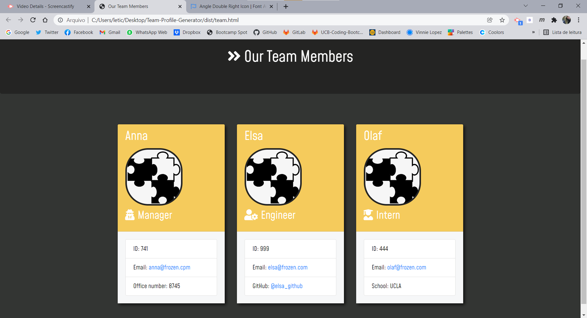

# Team Profile Generator


 ## Description

 This application will help you to make create a webpage to display the team member of your company automatically, according with the information you add.
    
 You can check how this application works clicking [here](https://youtu.be/t4-uY6IfXxA).


## Installation

First install node, navigate to your directory and install the following packages from your command line:
```
npm i jest --save-dev
npm i inquirer
```

## Mock-Up

The following image shows the generated HTML’s appearance and functionality. 




## Usage

To start the app, type the foloowing command on your terminal, answer the questions and get your HTML file will be generated.
```
node index.js
```

Here's a demonstration on how this app works.


## Contributing

If you want to contibute with this project, please contact the author.


## Questions

For questions, please contact:

Leticia Nardi at leticia.tnardi@gmail.com.

GitHub: http://github.com/leticianardi

